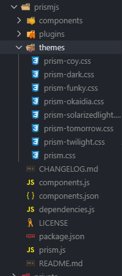

## 前言
一直想过做一个自己的博客，却一直被自己的拖延症耽搁。（说到底还是条懒狗。） 真正撸起袖子开始干的时候，又发现有这么多可选的框架。这时候选择困难症又犯了。。。

- [Hexo](https://hexo.io/zh-cn/docs/)，这个算国内用的比较多的了，我有个朋友也用的这个。
- [Vuepress](https://www.vuepress.cn/)，尤大大推出的vue驱动的静态页面生成器。
- [Gatsby](https://www.gatsbyjs.org/)，基于React和GraphQL的静态页面生成器。

这里我选择了用Gatsby，其一是因为我正好想学一学react，其二是因为它的自由度比较高，其三是因为用它的人相对较小，没错我就是这么非主流(因为用的人少，遇到问题解决起来也相对麻烦了一些，自己作啊)。

**特别鸣谢：**[ssshooter的文章](https://ssshooter.com/2019-02-11-gatsby-tutorial/)，为我使用Gatsby提供了很大的帮助。

## 问题总结
成功的路，总是艰难险阻。

### pngquant-bin
当在执行 `yarn`命令的时候，出现的这样的错误：
```
error D:\project\Web\my-blog-starter\node_modules\pngquant-bin: Command failed.
Exit code: 1
Command: node lib/install.js
Arguments:
Directory: D:\project\Web\my-blog-starter\node_modules\pngquant-bin
Output:
‼ read ECONNRESET
  ‼ pngquant pre-build test failed
  i compiling from source
```

但是这个问题又不影响我的项目的启动。我在网上找了好多解决方案最后都没有办法，我的强迫症都快被他给治好了。

不过我把他挂在VPS上之后就发现了问题：图片压缩问题。在本地打包好的项目从服务器上pull下来之后，图片显示会极其的不正常。

最后我的解决办法是在服务器上打包来避免这个问题。
Linux环境下运行Gatsby需要准备node、git 具体请查看[官方文档](https://www.gatsbyjs.org/docs/gatsby-on-linux/)


### Linux系统中的问题
我正按照执行官方文档的步骤执行命令，执行完
``` shell
curl -o- https://raw.githubusercontent.com/nvm-sh/nvm/v0.35.1/install.sh | bash
```
再执行
``` shell
nvm install 10
nvm use 10
```
去安装并使用node的时候，却报错了
``` shell
-bash: nvm: command not found 
```
经查阅资料 是因为环境变量的问题 

``` shell
cd ~/.nvm //进入nvm目录
touch .bash_profile //新建文件
open .bash_profile //打开文件
//写入内容
export NVM_DIR="$HOME/.nvm"
[ -s "$NVM_DIR/nvm.sh" ] && \. "$NVM_DIR/nvm.sh" # This loads nvm
//关闭文件夹
source .bash_profile
//测试是否成功
nvm --version
// 0.35.1
```
大功告成！ 

### 'prism-TOMORROW.css' not found
因为引入了prismjs的样式，我就直接用了。结果在Linux下打包是报错`'prism-TOMORROW.css' not found`。但是我在本地调试的时候一点问题都没有。
后来我查看了下prism包里的内容：


**注意：** Linux系统下是严格区分大小写的，所以命名一定要规范，不然会导致build项目失败的。